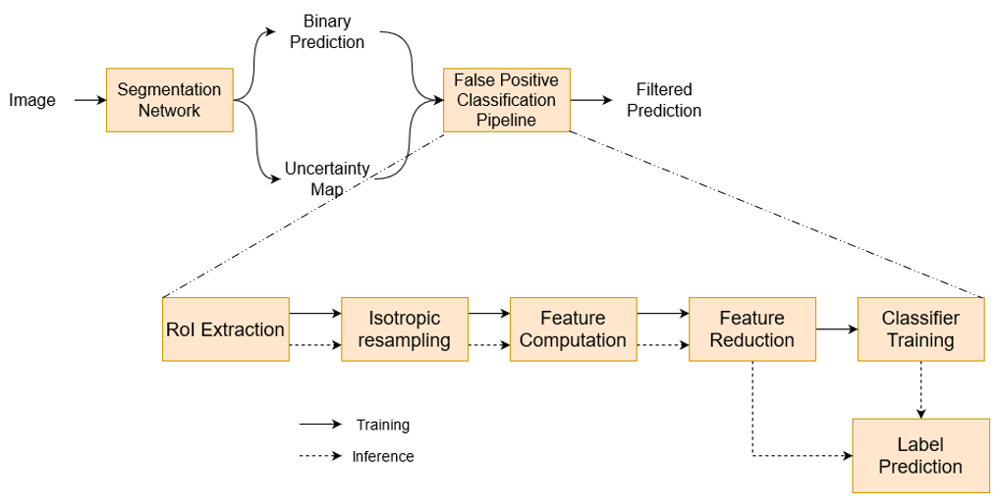
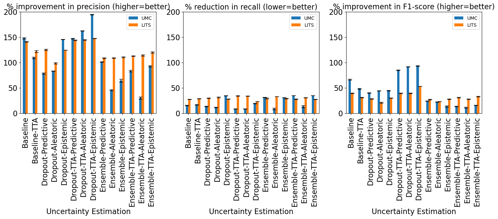

### False Positive Classification Pipeline

Figure 1 shows our false-positive classification pipeline used to study the influence of different uncertainty estimation methods on reducing false positives in liver lesion segmentation. 

Our code is organized as follows:
* fp_classification: 
    This folder implements the different blocks shown in Figure 1
    * patch_extraction.py : Extracts 3-D patches from uncertainty maps (corresponding to lesion volume) and computes radiomics features
    * analyze_feature_correlation.py: Performs hierarchical clustering (based on correlation) to produce a smaller set of decorrelated features used for training the classifier
    * train_rf.py: Using the reduced set of features, trains an Extremely Randomized Trees classifier to classify a given volume as a true positive or false positive
    * filter_predictions.py: Uses the trained classifier to make predictions and update lesion correspondence.
* segmentation: This folder contains code used to train neural networks to segment lesions from MR (UMC) and CT (LiTS) datasets.
* seg_metrics: This folder contains code used to compute precision, recall, and f1-score metrics while taking into account many-to-one and one-to-many correspondences between the ground truth and predicted segmentations.
* utils: This folder contains general utility functions shared across scripts.

We have studied the popular uncertainty estimation techniques such as MC-Dropout, test-time augmentations, and model ensembles to obtain the following results:

We studied the efficacy of features computed from uncertainty estimates at reducing false positives  by developing a classifier-based pipeline. We found that the relative improvement in the lesion detection metrics is mainly influenced by the class imbalance in the data used to train the classifier and the distribution of various shape-based features for all the uncertainty estimation methods we studied.
